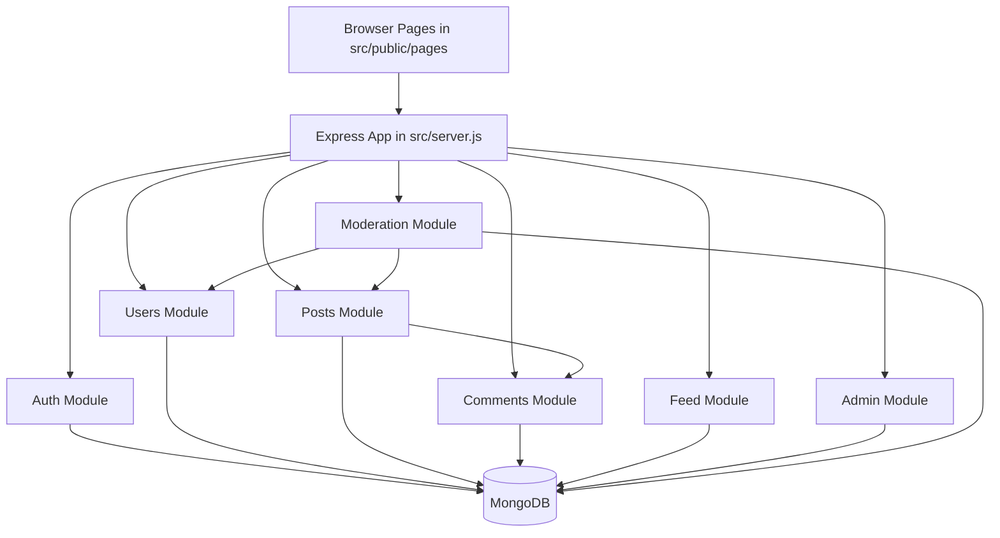
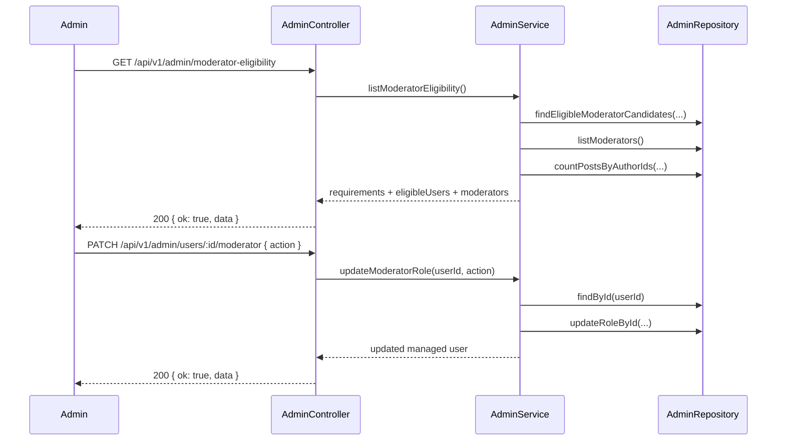
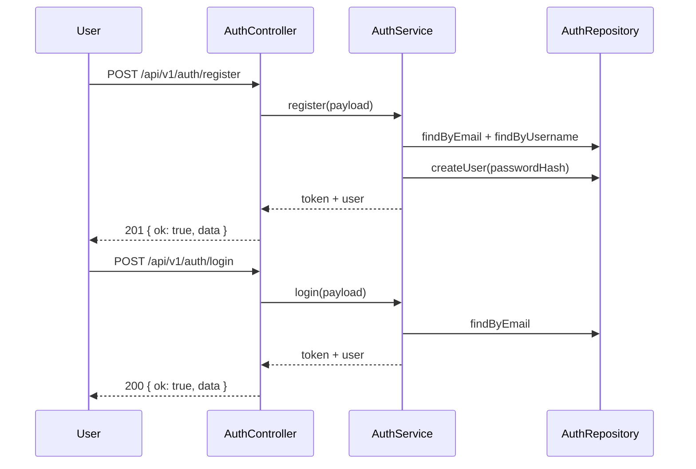
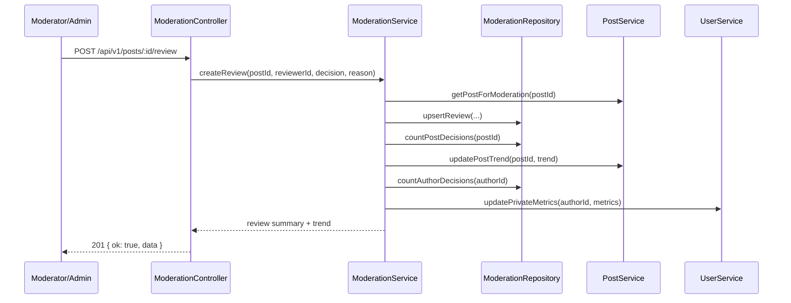
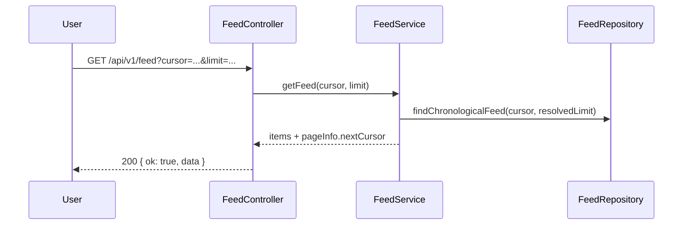

# Architecture Diagrams

## Component View

```mermaid
flowchart TD
  Client[Browser Pages in src/public/pages] --> API[Express App in src/server.js]
  API --> Auth[Auth Module]
  API --> Users[Users Module]
  API --> Posts[Posts Module]
  API --> Comments[Comments Module]
  API --> Feed[Feed Module]
  API --> Admin[Admin Module]
  API --> Moderation[Moderation Module]
  Auth --> Mongo[(MongoDB)]
  Users --> Mongo
  Posts --> Mongo
  Comments --> Mongo
  Feed --> Mongo
  Admin --> Mongo
  Moderation --> Mongo
  Moderation --> Posts
  Moderation --> Users
  Posts --> Comments
```

## Sequence: Admin Manages Moderators

```mermaid
sequenceDiagram
  participant A as Admin
  participant AC as AdminController
  participant AS as AdminService
  participant AR as AdminRepository
  A->>AC: GET /api/v1/admin/moderator-eligibility
  AC->>AS: listModeratorEligibility()
  AS->>AR: findEligibleModeratorCandidates(...)
  AS->>AR: listModerators()
  AS->>AR: countPostsByAuthorIds(...)
  AS-->>AC: requirements + eligibleUsers + moderators
  AC-->>A: 200 { ok: true, data }

  A->>AC: PATCH /api/v1/admin/users/:id/moderator { action }
  AC->>AS: updateModeratorRole(userId, action)
  AS->>AR: findById(userId)
  AS->>AR: updateRoleById(...)
  AS-->>AC: updated managed user
  AC-->>A: 200 { ok: true, data }
```

## Sequence: Register/Login

```mermaid
sequenceDiagram
  participant U as User
  participant A as AuthController
  participant S as AuthService
  participant R as AuthRepository
  U->>A: POST /api/v1/auth/register
  A->>S: register(payload)
  S->>R: findByEmail + findByUsername
  S->>R: createUser(passwordHash)
  S-->>A: token + user
  A-->>U: 201 { ok: true, data }

  U->>A: POST /api/v1/auth/login
  A->>S: login(payload)
  S->>R: findByEmail
  S-->>A: token + user
  A-->>U: 200 { ok: true, data }
```

## Sequence: Create Review

```mermaid
sequenceDiagram
  participant M as Moderator/Admin
  participant C as ModerationController
  participant S as ModerationService
  participant MR as ModerationRepository
  participant PS as PostService
  participant US as UserService
  M->>C: POST /api/v1/posts/:id/review
  C->>S: createReview(postId, reviewerId, decision, reason)
  S->>PS: getPostForModeration(postId)
  S->>MR: upsertReview(...)
  S->>MR: countPostDecisions(postId)
  S->>PS: updatePostTrend(postId, trend)
  S->>MR: countAuthorDecisions(authorId)
  S->>US: updatePrivateMetrics(authorId, metrics)
  S-->>C: review summary + trend
  C-->>M: 201 { ok: true, data }
```

## Sequence: Feed Pagination

```mermaid
sequenceDiagram
  participant U as User
  participant FC as FeedController
  participant FS as FeedService
  participant FR as FeedRepository
  U->>FC: GET /api/v1/feed?cursor=...&limit=...
  FC->>FS: getFeed(cursor, limit)
  FS->>FR: findChronologicalFeed(cursor, resolvedLimit)
  FS-->>FC: items + pageInfo.nextCursor
  FC-->>U: 200 { ok: true, data }
```
